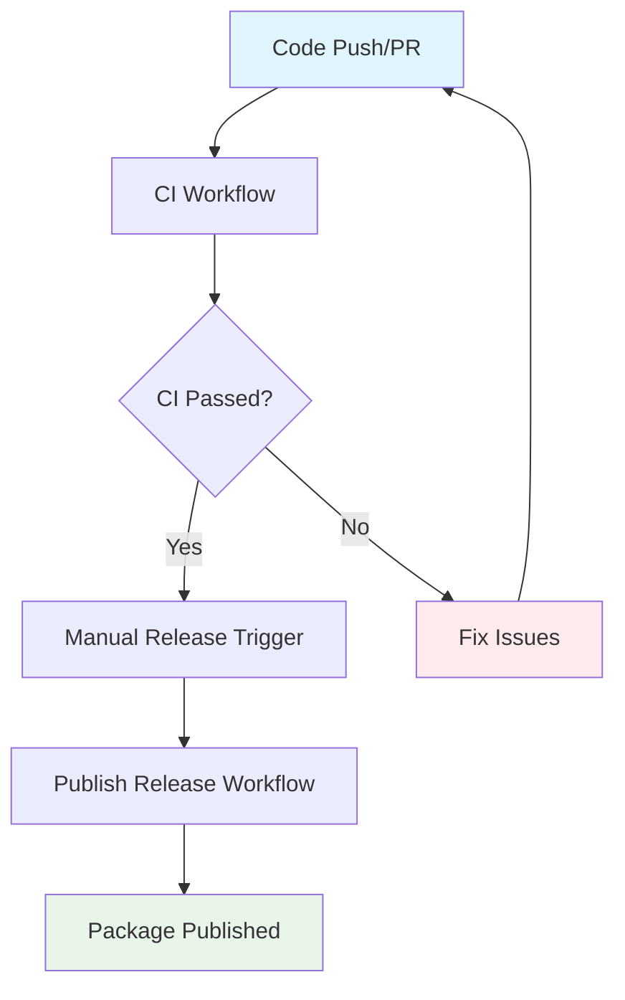

# GitHub Actions Workflows

This directory contains the GitHub Actions workflows for the jaspr_localizations package. These workflows implement the specifications defined in the [`/spec`](../../spec/) directory.

## Available Workflows

### 🔄 Continuous Integration (`ci.yml`)

**Purpose**: Automated code quality validation, testing, and build verification  
**Triggers**: Push to main/develop branches, pull requests, manual dispatch  
**Specification**: [spec-process-cicd-continuous-integration.md](../../spec/spec-process-cicd-continuous-integration.md)

**Features:**
- Multi-version Dart SDK testing (3.9.0, stable, beta)
- Code quality analysis (formatting, linting, static analysis)
- Comprehensive test suite with coverage reporting
- Package build verification
- Example application validation
- Security vulnerability scanning

**Jobs:**
1. **code-quality**: Static analysis and linting
2. **test-matrix**: Test execution across Dart versions
3. **build-verification**: Package build and analysis
4. **example-validation**: Example application compilation
5. **security-scan**: Dependency vulnerability audit
6. **aggregate-results**: Results aggregation and status reporting

### 🚀 Publish Release (`publish-release.yml`)

**Purpose**: Automated version management and publication to pub.dev  
**Triggers**: Manual workflow dispatch, version tags (v*.*.*), release publication  
**Specification**: [spec-process-cicd-publish-release.md](../../spec/spec-process-cicd-publish-release.md)

**Features:**
- Semantic version validation
- Comprehensive quality gates
- Automated changelog generation
- Package integrity verification
- pub.dev publication with verification
- GitHub release creation
- Rollback capabilities on failure

**Jobs:**
1. **validate-inputs**: Version format and input validation
2. **quality-gates**: Pre-publish quality validation
3. **version-update**: Version update and changelog generation
4. **build-package**: Package building and integrity verification
5. **publish-package**: Publication to pub.dev and GitHub release creation
6. **notify-failure**: Failure notification and cleanup

## Setup Requirements

### Repository Secrets

The following secrets must be configured in the repository settings:

#### Required for Publish Release

| Secret Name | Description | How to Obtain |
|-------------|-------------|---------------|
| `PUB_DEV_TOKEN` | Authentication token for pub.dev publishing | [pub.dev account settings](https://pub.dev/help/publishing#publishing-from-github-actions) |

#### Optional (Auto-configured)

| Secret Name | Description | Notes |
|-------------|-------------|-------|
| `GITHUB_TOKEN` | GitHub API access token | Automatically provided by GitHub Actions |

### Repository Settings

1. **Branch Protection**: Enable branch protection for `main` branch
   - Require status checks to pass before merging
   - Include CI workflow as required status check
   - Require branches to be up to date before merging

2. **Actions Permissions**: 
   - Allow read and write permissions for actions
   - Allow actions to create and approve pull requests

### Pub.dev Token Setup

1. Go to [pub.dev](https://pub.dev) and sign in
2. Navigate to your account settings
3. Generate a new token for automated publishing
4. Add the token as `PUB_DEV_TOKEN` secret in repository settings

The token should be in JSON format:
```json
{
  "accessToken": "your-access-token",
  "refreshToken": "your-refresh-token",
  "tokenEndpoint": "https://oauth2.googleapis.com/token",
  "scopes": ["openid", "https://www.googleapis.com/auth/userinfo.email"]
}
```

## Usage

### Running CI

The CI workflow runs automatically on:
- Push to `main`, `develop`, or `release/*` branches
- Pull request creation or updates targeting `main` or `develop`

Manual trigger:
```bash
# Via GitHub CLI
gh workflow run ci.yml

# Via GitHub web interface
# Go to Actions tab > Continuous Integration > Run workflow
```

### Publishing a Release

#### Method 1: Manual Workflow Dispatch

1. Go to Actions tab in GitHub repository
2. Select "Publish Release" workflow
3. Click "Run workflow"
4. Enter the version number (e.g., `1.2.3`)
5. Optionally mark as prerelease
6. Click "Run workflow"

#### Method 2: Git Tag

```bash
git tag v1.2.3
git push origin v1.2.3
```

#### Method 3: GitHub CLI

```bash
gh workflow run publish-release.yml -f version=1.2.3 -f prerelease=false
```

### Emergency Releases

For emergency releases that need to skip tests:

```bash
gh workflow run publish-release.yml \
  -f version=1.2.3 \
  -f prerelease=false \
  -f skip_tests=true
```

> ⚠️ **Warning**: Only use `skip_tests=true` for critical security fixes or urgent patches.

## Monitoring and Troubleshooting

### Workflow Status

Monitor workflow execution through:
- GitHub Actions tab
- Repository README badges (if configured)
- Email notifications (if enabled)

### Common Issues

#### CI Failures

1. **Test Failures**: Check test output in the `test-matrix` job
2. **Coverage Issues**: Ensure test coverage is ≥90%
3. **Linting Errors**: Run `dart format` and `dart analyze` locally
4. **Package Score**: Run `dart pub global run pana` to check package quality

#### Release Failures

1. **Version Conflicts**: Check if version already exists on pub.dev
2. **Quality Gates**: Ensure all tests pass and coverage is adequate
3. **Authentication**: Verify `PUB_DEV_TOKEN` is correctly configured
4. **Network Issues**: Check pub.dev service status

### Debugging

Enable debug logging by setting repository secrets:
- `ACTIONS_STEP_DEBUG=true` - Enable step debugging
- `ACTIONS_RUNNER_DEBUG=true` - Enable runner debugging

## Workflow Dependencies



## Performance Metrics

### Target Performance

| Workflow | Target Duration | Typical Duration |
|----------|----------------|------------------|
| CI | < 8 minutes | ~5 minutes |
| Publish Release | < 10 minutes | ~7 minutes |

### Optimization Features

- **Dependency Caching**: Reduces pub get time by ~80%
- **Matrix Strategy**: Parallel execution across Dart versions
- **Artifact Sharing**: Efficient data transfer between jobs
- **Conditional Execution**: Skip unnecessary steps based on context

## Contributing

When modifying workflows:

1. **Update Specifications First**: Modify files in `/spec` directory
2. **Test Changes**: Use workflow dispatch to test modifications
3. **Document Changes**: Update this README and inline comments
4. **Version Control**: Follow semantic versioning for workflow versions

### Testing Workflow Changes

1. Create a feature branch
2. Modify workflow files
3. Push to trigger CI
4. Test publish workflow with dry-run or prerelease
5. Create pull request with detailed testing notes

## Related Documentation

- [Workflow Specifications](../../spec/)
- [GitHub Actions Documentation](https://docs.github.com/en/actions)
- [pub.dev Publishing Guide](https://dart.dev/tools/pub/publishing)
- [Dart CI/CD Best Practices](https://dart.dev/guides/testing)
