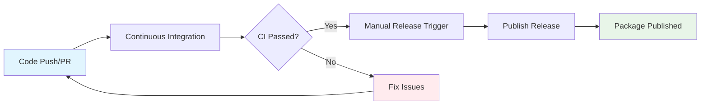

# Workflow Specifications

This directory contains comprehensive specifications for GitHub Actions workflows used in the jaspr_localizations project. These specifications serve as implementation-agnostic documentation that defines workflow behavior, requirements, and constraints.

## Available Specifications

### [Continuous Integration](./spec-process-cicd-continuous-integration.md)

**Purpose**: Automated code quality validation, testing, and build verification  
**Triggers**: Push to main/develop, pull requests, manual dispatch  
**Key Features**:

- Multi-version Dart SDK testing (3.9.0, stable, beta)
- Comprehensive quality gates (linting, testing, coverage)
- Build verification and example validation
- Performance monitoring and caching

### [Publish Release](./spec-process-cicd-publish-release.md)

**Purpose**: Automated version management and publication to pub.dev  
**Triggers**: Manual workflow dispatch, version tags, release publication  
**Key Features**:

- Semantic version validation and management
- Comprehensive quality gates before publish
- Automated changelog generation
- pub.dev publication with rollback capabilities
- GitHub release creation

## Specification Format

Each specification follows a structured format designed for:

- **Token Efficiency**: Concise language with maximum information density
- **Implementation Abstraction**: Focus on behavior rather than syntax
- **Maintainability**: Easy updates as workflows evolve
- **AI Optimization**: Structured data for efficient processing

### Key Sections

1. **Workflow Overview**: Purpose, triggers, and target environments
2. **Execution Flow**: Mermaid diagrams showing job dependencies
3. **Requirements Matrix**: Functional, security, and performance requirements
4. **Input/Output Contracts**: Defined interfaces and data exchange
5. **Quality Gates**: Validation criteria and bypass conditions
6. **Error Handling**: Failure scenarios and recovery strategies
7. **Integration Points**: External system dependencies
8. **Monitoring**: Key metrics and alerting strategies

## Usage Guidelines

### For Developers

- Review specifications before implementing workflows
- Ensure all requirements are met in implementation
- Update specifications before making workflow changes

### For DevOps Engineers

- Use as templates for similar workflows
- Reference for troubleshooting and optimization
- Maintain specifications alongside workflow changes

### For Project Managers

- Understand workflow capabilities and constraints
- Reference for planning and timeline estimation
- Monitor against defined SLAs and metrics

## Workflow Dependencies

## Implementation Status

| Workflow | Specification | Implementation | Status |
|----------|---------------|----------------|---------|
| Continuous Integration | ✅ Complete | ⏳ Pending | Ready for Implementation |
| Publish Release | ✅ Complete | ⏳ Pending | Ready for Implementation |

## Best Practices

### Specification Maintenance

- Update specifications before implementing changes
- Version specifications with semantic versioning
- Review specifications during workflow retrospectives
- Keep implementation notes current

### Quality Assurance

- Validate implementations against specifications
- Test workflows in staging environments
- Monitor metrics defined in specifications
- Document deviations with justification

## Related Documentation

- [GitHub Actions Documentation](https://docs.github.com/en/actions)
- [Dart Package Publishing Guide](https://dart.dev/tools/pub/publishing)
- [Semantic Versioning Specification](https://semver.org/)
- [pub.dev Publishing Guidelines](https://pub.dev/help/publishing)

## Contributing

When adding new workflow specifications:

1. Follow the established template structure
2. Include comprehensive requirements matrices
3. Define clear validation criteria
4. Document integration points and dependencies
5. Update this README with new specifications

For specification updates:

1. Update version number and date
2. Document changes in version history
3. Review impact on dependent workflows
4. Validate against implementation requirements
