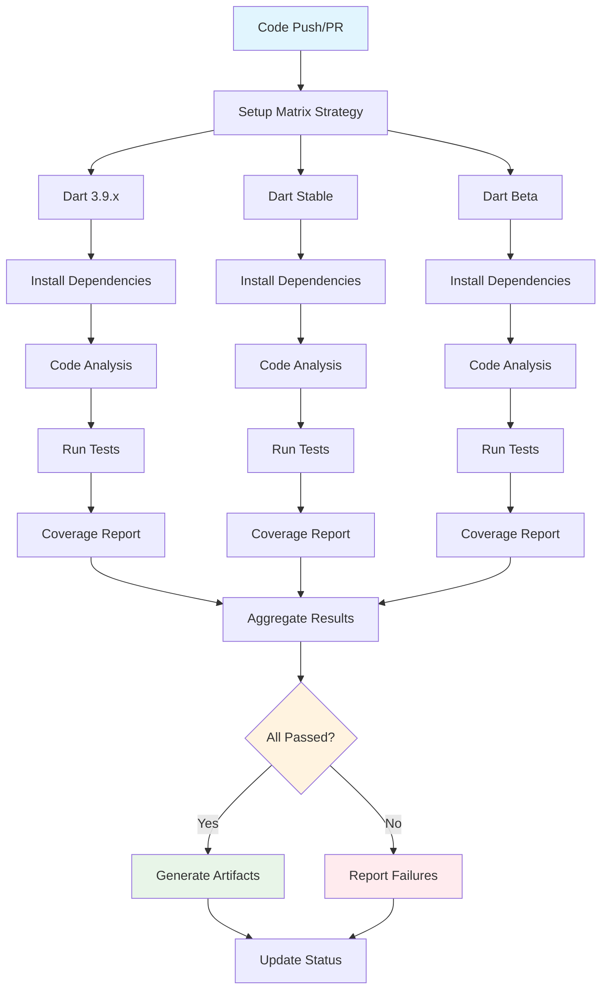

## Workflow Overview

**Purpose**: Automated code quality validation, testing, and build verification for jaspr_localizations package
**Trigger Events**: Push to main/develop branches, pull request creation/updates, manual dispatch
**Target Environments**: GitHub Actions runners, multiple Dart SDK versions

## Execution Flow Diagram



## Jobs & Dependencies

| Job Name | Purpose | Dependencies | Execution Context |
|----------|---------|--------------|-------------------|
| code-quality | Static analysis and linting | None | ubuntu-latest |
| test-matrix | Run tests across Dart versions | code-quality | ubuntu-latest matrix |
| coverage-report | Generate test coverage metrics | test-matrix | ubuntu-latest |
| build-verification | Verify package builds correctly | test-matrix | ubuntu-latest |
| example-validation | Validate example applications | build-verification | ubuntu-latest |

## Requirements Matrix

### Functional Requirements

| ID | Requirement | Priority | Acceptance Criteria |
|----|-------------|----------|-------------------|
| REQ-001 | Code quality validation | High | Zero analyzer errors, lint score 100/100 |
| REQ-002 | Comprehensive test coverage | High | ≥90% line coverage, all tests pass |
| REQ-003 | Multi-version compatibility | High | Support Dart 3.9+ through latest stable |
| REQ-004 | Dependency security scan | Medium | No high/critical vulnerabilities |
| REQ-005 | Build verification | High | Package builds without errors |
| REQ-006 | Example validation | Medium | All examples compile and run |
| REQ-007 | Documentation generation | Low | API docs generate successfully |

### Performance Requirements

| ID | Metric | Target | Measurement Method |
|----|-------|--------|-------------------|
| PERF-001 | Total CI execution time | < 8 minutes | GitHub Actions timer |
| PERF-002 | Test execution time | < 3 minutes | Test runner metrics |
| PERF-003 | Dependency caching efficiency | > 80% cache hit rate | Cache statistics |

## Input/Output Contracts

### Inputs

```yaml
# Trigger Events
push:
  branches: [main, develop, 'release/*']
  paths: ['lib/**', 'test/**', 'pubspec.yaml']

pull_request:
  branches: [main, develop]
  types: [opened, synchronize, reopened]

# Environment Variables
DART_SDK_VERSIONS: ["3.9.0", "stable", "beta"]  # SDK versions to test
PUB_CACHE: "/tmp/pub_cache"                      # Dependency cache location
COVERAGE_THRESHOLD: "90"                         # Minimum coverage percentage
```

### Outputs

```yaml
# Artifacts
test_results: junit      # Test results in JUnit format
coverage_report: lcov    # Coverage data in LCOV format
build_artifacts: tar.gz  # Built package files
analysis_report: json    # Static analysis results

# Status Checks
quality_gate: boolean    # Overall quality gate status
test_status: boolean     # Test execution status
coverage_status: boolean # Coverage threshold status
```

## Quality Gates

### Gate Definitions

| Gate | Criteria | Bypass Conditions |
|------|----------|-------------------|
| Code Analysis | dart analyze: zero errors/warnings | Never bypassed |
| Lint Score | dart pub global activate pana: 100/100 | Never bypassed |
| Test Coverage | ≥90% line coverage | Draft PR only |
| Dependency Security | No vulnerabilities rated high+ | Manual security review |
| Performance Tests | Benchmarks within 10% of baseline | Manual performance review |

## Error Handling Strategy

| Error Type | Response | Recovery Action |
|------------|----------|-----------------|
| Dependency Resolution Failure | Retry with cache clear | Clear pub cache, retry up to 2x |
| Test Execution Failure | Report detailed output | Show failed test details, exit |
| Coverage Below Threshold | Warning for PR, block merge | Display coverage delta, require fixes |
| Analyzer Errors | Block with detailed report | Show specific errors, require resolution |
| Build Failure | Block with logs | Display build output, require fixes |

## Integration Points

### External Systems

| System | Integration Type | Data Exchange | SLA Requirements |
|--------|------------------|---------------|------------------|
| GitHub API | REST API | Status checks, PR comments | 99.9% uptime |
| pub.dev | Package Registry | Dependency resolution | 99% uptime |
| Dart SDK | Local Install | Compilation, analysis | Always available |
| Test Framework | CLI Tool | Test execution results | Local execution |

### Dependent Workflows

| Workflow | Relationship | Trigger Mechanism |
|----------|--------------|-------------------|
| Publish Release | Gated by CI | CI must pass before publish |
| Security Scan | Parallel execution | Triggered on same events |
| Performance Benchmark | Conditional | Weekly scheduled runs |

## Monitoring & Observability

### Key Metrics

- **Build Success Rate**: Target 95% pass rate
- **Average Execution Time**: Target < 6 minutes
- **Cache Hit Rate**: Target > 80% for dependencies
- **Test Stability**: < 1% flaky test rate

### Alerting

| Condition | Severity | Notification Target |
|-----------|----------|-------------------|
| Build Failure Rate > 20% | High | Development team |
| Coverage Trend Declining | Medium | Tech lead |
| Execution Time > 10 minutes | Medium | DevOps team |

## Validation Criteria

### Workflow Validation

- **VLD-001**: All configured Dart SDK versions execute successfully
- **VLD-002**: Test coverage meets or exceeds threshold
- **VLD-003**: Static analysis produces zero errors/warnings
- **VLD-004**: All example applications build and run
- **VLD-005**: Generated artifacts are valid and complete

### Performance Benchmarks

- **PERF-001**: Dependency installation completes within 90 seconds
- **PERF-002**: Test suite execution completes within 180 seconds
- **PERF-003**: Code analysis completes within 60 seconds

## Implementation Notes

### Workflow File Location

- **Path**: `.github/workflows/ci.yml`
- **Naming Convention**: `ci` for continuous integration pipeline

### Matrix Strategy

```yaml
strategy:
  matrix:
    dart-version: [3.9.0, stable, beta]
    os: [ubuntu-latest]
  fail-fast: false
```

### Caching Strategy

- **Dependencies**: Cache pub dependencies by pubspec.yaml hash
- **Analysis**: Cache analyzer results by source code hash
- **Build Artifacts**: Cache between jobs within same workflow run

### Required Repository Settings

- **Branch Protection**: Require CI status checks for main branch
- **Permissions**: Actions need read access to repository contents
- **Secrets**: None required for basic CI functionality
