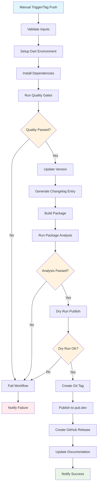

## Workflow Overview

**Purpose**: Automate version management, package validation, and publication to pub.dev for jaspr_localizations package
**Trigger Events**: Manual workflow dispatch, version tag creation (v*.*.*), release publication
**Target Environments**: GitHub Actions runners, pub.dev registry

## Execution Flow Diagram



## Jobs & Dependencies

| Job Name | Purpose | Dependencies | Execution Context |
|----------|---------|--------------|-------------------|
| validate-inputs | Validate version format and inputs | None | ubuntu-latest |
| quality-gates | Run tests, linting, and analysis | validate-inputs | ubuntu-latest |
| version-update | Update version in pubspec.yaml | quality-gates | ubuntu-latest |
| build-package | Build and validate package | version-update | ubuntu-latest |
| publish-package | Publish to pub.dev and create release | build-package | ubuntu-latest |

## Requirements Matrix

### Functional Requirements

| ID | Requirement | Priority | Acceptance Criteria |
|----|-------------|----------|-------------------|
| REQ-001 | Validate semantic version format | High | Version matches semver pattern (x.y.z) |
| REQ-002 | Execute comprehensive quality gates | High | All tests pass, linting clean, 90%+ coverage |
| REQ-003 | Update package version atomically | High | pubspec.yaml and CHANGELOG.md updated consistently |
| REQ-004 | Perform dry-run validation | High | pub publish --dry-run succeeds before actual publish |
| REQ-005 | Create git tag and GitHub release | Medium | Tag created with release notes from changelog |
| REQ-006 | Publish package to pub.dev | High | Package successfully published and available |
| REQ-007 | Rollback on failure | Medium | No partial state left on failure |

### Security Requirements

| ID | Requirement | Implementation Constraint |
|----|-------------|---------------------------|
| SEC-001 | Secure credential management | Use GitHub secrets for pub.dev token |
| SEC-002 | Validate package integrity | Checksum validation before publish |
| SEC-003 | Restrict workflow permissions | Minimal required permissions only |
| SEC-004 | Audit trail maintenance | All actions logged with timestamps |

### Performance Requirements

| ID | Metric | Target | Measurement Method |
|----|-------|--------|-------------------|
| PERF-001 | Total workflow execution time | < 10 minutes | GitHub Actions timer |
| PERF-002 | Dependency installation time | < 2 minutes | Job step timing |
| PERF-003 | Test execution time | < 3 minutes | Test runner output |

## Input/Output Contracts

### Inputs

```yaml
# Workflow Inputs
version:
  type: string
  required: true
  description: "Semantic version (e.g., 1.2.3)"
  pattern: "^[0-9]+\\.[0-9]+\\.[0-9]+$"

prerelease:
  type: boolean
  required: false
  default: false
  description: "Mark as prerelease"

skip_tests:
  type: boolean
  required: false
  default: false
  description: "Skip test execution (emergency only)"

# Environment Variables
DART_SDK_VERSION: "stable"  # Purpose: Dart SDK version to use
PUB_CACHE: "/tmp/pub_cache"  # Purpose: Pub cache directory
```

### Outputs

```yaml
# Job Outputs
package_version: string      # Description: Final package version published
release_url: string         # Description: GitHub release URL
pub_dev_url: string        # Description: pub.dev package URL
changelog_entry: string    # Description: Generated changelog entry
build_artifacts: file[]   # Description: Built package files
```

### Secrets & Variables

| Type | Name | Purpose | Scope |
|------|------|---------|-------|
| Secret | PUB_DEV_TOKEN | Authentication for pub.dev publishing | Repository |
| Secret | GITHUB_TOKEN | GitHub API access for releases | Workflow |
| Variable | PACKAGE_MAINTAINER | Package maintainer email | Repository |
| Variable | NOTIFICATION_WEBHOOK | Success/failure notification endpoint | Repository |

## Execution Constraints

### Runtime Constraints

- **Timeout**: 15 minutes maximum execution time
- **Concurrency**: Single execution (no parallel releases)
- **Resource Limits**: Standard GitHub Actions limits
- **Retry Logic**: 3 attempts for network-dependent operations

### Environmental Constraints

- **Runner Requirements**: ubuntu-latest with Dart SDK
- **Network Access**: pub.dev, GitHub API, package registries
- **Permissions**: contents:write, packages:write, actions:read
- **Dependencies**: Dart SDK 3.9+, pub CLI tool

## Error Handling Strategy

| Error Type | Response | Recovery Action |
|------------|----------|-----------------|
| Version Format Invalid | Fail Fast | Display format requirements, exit |
| Quality Gates Failure | Fail with Details | Show test/lint results, require fixes |
| Version Conflict | Fail with Context | Check existing versions, suggest increment |
| Publish Network Error | Retry with Backoff | 3 attempts with exponential backoff |
| Git Tag Conflict | Fail with Resolution | Show existing tag, require cleanup |
| Partial Publish State | Manual Intervention | Log state, require manual resolution |

## Quality Gates

### Gate Definitions

| Gate | Criteria | Bypass Conditions |
|------|----------|-------------------|
| Code Quality | Dart analyze: no errors, lints: score 100/100 | skip_tests=true (emergency only) |
| Test Coverage | All tests pass, coverage ≥ 90% | skip_tests=true (emergency only) |
| Package Analysis | pub publish --dry-run: success | Never bypassed |
| Version Uniqueness | Version not published on pub.dev | Never bypassed |
| Dependency Security | No known vulnerabilities | Manual approval required |

## Monitoring & Observability

### Key Metrics

- **Success Rate**: Target 95% successful publications
- **Execution Time**: Target < 8 minutes average
- **Resource Usage**: Monitor runner utilization

### Alerting

| Condition | Severity | Notification Target |
|-----------|----------|-------------------|
| Workflow Failure | High | Package maintainers, DevOps team |
| Quality Gate Failure | Medium | Development team |
| Publish Timeout | High | DevOps team |
| Security Scan Alert | Critical | Security team, maintainers |

## Integration Points

### External Systems

| System | Integration Type | Data Exchange | SLA Requirements |
|--------|------------------|---------------|------------------|
| pub.dev | REST API | Package metadata, tarball | 99% uptime |
| GitHub API | REST API | Release data, repository metadata | 99.9% uptime |
| Dart Package Analyzer | CLI Tool | Analysis results | Local execution |
| Git Repository | VCS | Source code, tags, commits | Always available |

### Dependent Workflows

| Workflow | Relationship | Trigger Mechanism |
|----------|--------------|-------------------|
| CI Pipeline | Prerequisite | Must pass before publish |
| Documentation Update | Triggered | On successful publish |
| Example Validation | Triggered | On successful publish |

## Compliance & Governance

### Audit Requirements

- **Execution Logs**: 90-day retention in GitHub Actions
- **Approval Gates**: Maintainer approval for major versions
- **Change Control**: All version changes tracked in git history

### Security Controls

- **Access Control**: Maintainer role required for workflow dispatch
- **Secret Management**: 90-day token rotation policy
- **Vulnerability Scanning**: Pre-publish dependency scan
- **Code Signing**: Package integrity verification

## Edge Cases & Exceptions

### Scenario Matrix

| Scenario | Expected Behavior | Validation Method |
|----------|-------------------|-------------------|
| Duplicate Version | Fail with clear error message | Check pub.dev API before publish |
| Network Outage During Publish | Retry with backoff, fail after 3 attempts | Monitor network connectivity |
| Partial Git State | Cleanup and retry or fail safely | Git status validation |
| Invalid Changelog Format | Auto-generate minimal entry | Changelog parser validation |
| Large Package Size | Warn but continue if under limits | Package size validation |
| Breaking API Changes | Require major version increment | API diff analysis |

## Validation Criteria

### Workflow Validation

- **VLD-001**: Version format validates against semver specification
- **VLD-002**: All quality gates execute successfully before publish
- **VLD-003**: Package builds without errors or warnings
- **VLD-004**: Git repository state is clean after completion
- **VLD-005**: Published package is accessible on pub.dev within 5 minutes

### Performance Benchmarks

- **PERF-001**: Dependency resolution completes within 120 seconds
- **PERF-002**: Test suite execution completes within 180 seconds
- **PERF-003**: Package publish operation completes within 60 seconds

## Change Management

### Update Process

1. **Specification Update**: Modify this document first
2. **Review & Approval**: Technical lead and maintainer approval required
3. **Implementation**: Apply changes to workflow YAML
4. **Testing**: Execute workflow in test repository
5. **Deployment**: Merge to main branch

### Version History

| Version | Date | Changes | Author |
|---------|------|---------|--------|
| 1.0 | 2024-10-30 | Initial specification for pub.dev publishing workflow | DevOps Team |

## Related Specifications

- [Link to CI pipeline specification]
- [Link to code quality standards]
- [Link to security requirements]
- [Link to release management process]

## Implementation Notes

### Workflow File Location

- **Path**: `.github/workflows/publish-release.yml`
- **Naming Convention**: `publish-release` for main publishing workflow

### Required Repository Settings

- **Secrets**: PUB_DEV_TOKEN must be configured with valid pub.dev credentials
- **Branch Protection**: main branch should require PR reviews
- **Permissions**: Actions must have write access to contents and packages

### Testing Strategy

- **Dry Run Testing**: Use separate test package for workflow validation
- **Staging Environment**: Test against pub.dev staging if available
- **Rollback Plan**: Manual intervention process documented for failed publishes
